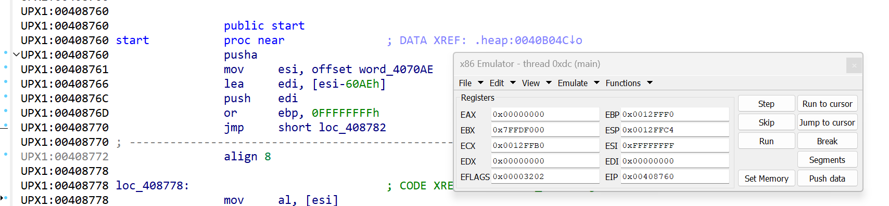
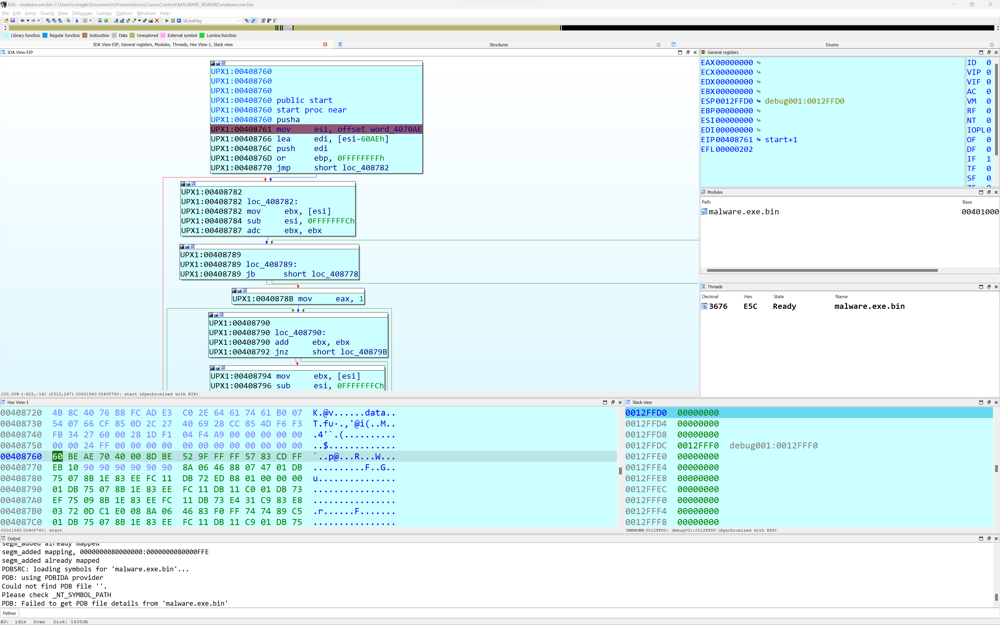
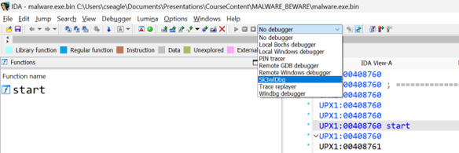
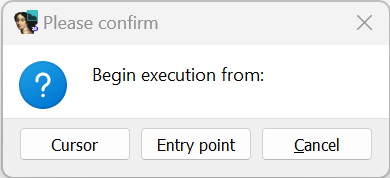

# The SK3wldbg Plugin

When I first started analyzing obfuscated code, I quite often wished that I
could simply de-obfuscate the code within IDA without the need to run the code
under debugger control, capture modified memory regions, and finally copy the
modified blocks back into IDA in order to disassemble and analyze the, now de-
obfuscated, code.

In 2002, IDA did not yet have a built in debugger, and IdaPython was still a few
years away. Many of my initial efforts to perform deobfuscation involved writing
IDC scripts to mimic the behavior of the de-obfuscation routines while writing
changes back into the IDA database. When the scripts were finished, I could simply
disassemble the modified bytes that were present in IDA. I still have an IDC script
that will unpack UPX in place.

I quickly realized that if had an x86 emulator that used IDA as its memory store,
that I could stop writing new scripts and just run the emulator whenever I encountered
obfuscated code. Thus was born the [x86emu plugin](https://github.com/cseagle/x86emu).

At the time, I didn't really want to write an x86 emulator from scratch, and I searched
for existing emulators that I could modify to suit my purposes. QEMU was the most likely
candidate at the time but was almost too fully featured as I had not interest in anything
other than the instruction set emulator and I did not want to invest the time to remove
all of the hardware support that QEMU provided.

Fast forward to 2015 and the release of the [Unicorn Engine](https://www.unicorn-engine.org/).
The developers of Unicorn did exactly what I had elected not to do 12 years earlier, they
ripped the hardware support out of QEMU and were able to release a tool that allowed for
the easy creation of emulators for most architectures supported by QEMU. In the meantime,
Hex-Rays had begun shipping GUI versions of IDA for Linux and OS X in addition to Windows,
as well as local and remote debuggers for each of those platforms, including a Bochs based
emulation plugin that provided a native IDA debugging interface to a Bochs emulation of 
code loaded in IDA.

I decided that the time had come to revisit my effort to bake an emulator into IDA and Unicorn
would serve as the core of a new debugger plugin - skw3ldbg.

## Debugger Plugins

Most people are familiar on some level with IDA plugins. What people may not be as familiar with
is the fact that are roughly four broad categories of plugin types (FIX, PROC, DBG, and "normal").
Those interested in the finer points should refer to loader.hpp from the IDA SDK for more information
about the distinction between each type. Across the IDA plugin ecosystem "normal" plugins are by far
the most common among those that are publicly availble.

A debugger (DBG) plugin is specifically designed to facilitate communications between IDA and
and a debugger being used to run the code you have loaded in IDA. Each of the debuggers that 
ship with IDA are implemented as debugger plugins and include local native debuggers for Windows,
Linux and OS X ad well as shims that allow IDA to communicate with existing debuggers
(WinDbg and gdbserver) or one of Hex-Rays remote debugging servers available for several platforms.

All standard debugging features are available when using these plugins such as launching new
processes, attaching to existing processes, breakpoint manipulating including hardware and
software breakpoint handling as well as arbitrarily complex conditional breakpoints. Debugger plugins
need not concern themselves with how information is presented to the user, Hex-Rays has already 
created a standard set of displays used across all debugger plugins. Instead each debuggger
plugin is responsible for furnishing IDA with the information necessary to populate the displays
of interest to the IDA user such as register and memory contents, and thread and module related data.
As a result, using any debugger plugin provides a uniform debugging experience regardless of the
debugging back end you happen to be communicating with.

### Debugging with Bochs as a model emulation

Unique among the Hex-Rays provided debugger plugins is a one that allows x86 code to be loaded into a Bochs
emulation which is then controlled by the provided IDA debugging interface. No attempt is made to provide
a full execution environment for the code that you wish to emulate. In the simplest case, the IDA's Bochs
debugger plugin simply maps the content of your IDA database into Bochs memory regions, allocates a stack
regions in Bochs, initializes regiters with some sane defaults, then allows Bochs to begin the emulation.
There are some signficant limitations to the fidelity of the emualtion however as no additional binaries
required by the process such as libc.so or kernel32.dll are loaded into Bochs, nor does Bochs have access
to a kernel which might be capable of handling system calls made by the process under emulation.

Please refer to [Debugging with Bochs](https://www.hex-rays.com/wp-content/uploads/2019/12/debugging_bochs.pdf) and
[Boch's Help](https://www.hex-rays.com/products/ida/support/idadoc/1329.shtml) form more information
on debugging with IDA and Bochs.

## Sk3wldbg

With the Hex-Rays Bochs debugger as a model for emulation based debugging in IDA, all I needed was the ability
to emulate many instruction sets which became a reality with the release of the Unicorn Engine.

Debugger plugins must instantiate a debugger_t object then set the global dbg pointer in IDA to point to the 
debugger_t instance. The majority of the implementation of a debugger is implemented in a mandatory callback
function that processes more than 40 debugger related notification messages. Fortunately Hex-Rays provides a 
large amount of debugger related example code as part of the IDA SDK to assist in understanding the required
behaviors.

In the sk3wldbg implementation, debugger_t is subclassed for Unicorn specific behaviors, then subclassed again
for each architecture supported by Unicorn. When IDA is operating on a binary whose processor is supported
by Unicorn, an appropriate debugger instance is constructed based on the current processor module and Sk3wldbg
will be listed as an available debugger option. When execution begins sk3wldbg attempts to map and load the
original disk file into Unicorn memory space using crude PE or ELF loaders. For other file types, sk3wldbg maps
and loads the Unicorn memory space using segment information and content from IDA. In both cases, a stack region
is mapped into Unicorn and initial register values are assigned. Emulation occurs in a separate IDA qthread and
synchronization is performed using a shared event queue and IDA qsemaphore objects.

Once execution begins, the user experience is similar to that of using any of IDAs other debuggers, including
the use of breakpoints, execution controls and the ability to take memory snapshots.  Breakpoints more closely
resemble hardware breakpoints (software breakpoints are not inserted in the Unicorn memory space) and they are
monitored by hooking the execution of each instruction in the execution thread. 

## Installation

Sk3wldbg is available on [github](https://github.com/cseagle/sk3wldbg) using the supplie Makefile or Visual Studio
solution file. Copy the resulting plugin (sk3wldbg_user) into IDA's plugins directory and make sure that you have
Unicorn installed on your system and if all goes well, sk3wldbg will show up and be available in IDA as a debugger
option. 

## Usage

After choosing Sk3wldbg as your debugger and setting some breakpoints, launch a debugging session using `Debugger/Start process`
or the Start process toolbar button. Sk3wldbg asks where execution should begin.

Select either the cursor location or the program entry point as your initial program counter value and control execution
as you would any other process that you are debugging. NOTE: It is a good idea to set a breakpoint near the execution start
point in order to make sure that you gain control over the emulation.

## Limitations

* Sk3wldbg can only execute code that is present in your IDA database. It cannot currently follow execution into 
shared libraries or handle system calls.
* None of the notifications required to support the Appcall interface are currently implemented.

----------------------------------------------------------------------

  
 
  
 
 
